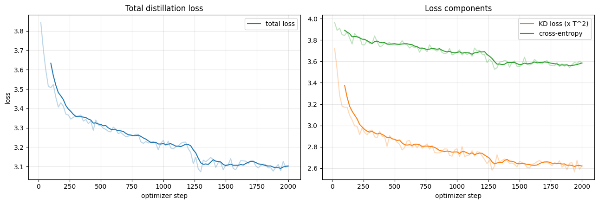

# GPT-2 Distillation from Mistral-7B-Instruct

Cross-tokenizer knowledge distillation: a **GPT-2 (124M)** student learns from a **Mistral-7B-Instruct-v0.2** teacher, end to end on a single free-tier Colab T4 GPU.

[](https://colab.research.google.com/github/Sahilkumar-r/gpt2-distillation-mistral7b/blob/main/notebooks/gpt2_distillation_mistral7b.ipynb)
[](https://huggingface.co/Sahilkumarr/gpt2-124m-distilled-from-mistral7b)

> **Honest summary:** the pipeline works and the training loss falls steadily, but in this run the distilled model's WikiText-2 perplexity did **not** improve (28.98 → 29.64). This repo is best read as a working, resumable reference implementation of cross-tokenizer logit distillation, plus a documented negative-ish first result, not as a better GPT-2. See [Results](#results) and [Limitations](#limitations--next-steps).

---

## The interesting problem: the two models don't share a tokenizer

| | Tokenizer | Vocab size |
|---|---|---|
| Student: GPT-2 | byte-level BPE | 50,257 |
| Teacher: Mistral-7B | SentencePiece | 32,000 |

Standard logit distillation needs a 1:1 mapping between teacher and student output tokens. Here it doesn't exist, so the notebook does three things:

1. **Shared vocabulary.** Keep only tokens whose literal text is identical in both vocabularies (**21,366** tokens: 43% of GPT-2's vocab, 67% of Mistral's). The KL term is computed over this subset, renormalised with a softmax.
2. **Character-boundary alignment.** A student position is distilled only if the teacher's tokenisation also has a token boundary at the same character offset, so both models are predicting "the next token starting at the same place". In this run **99%** of student positions received a KD target.
3. **Cross-entropy everywhere.** Plain next-token CE on the true text is applied at every position, so unaligned positions still give a learning signal.

Text is cleaned and reduced to ASCII so that character offsets equal byte offsets, which keeps the alignment exact.

**Alignment sanity check** (built into the notebook): on aligned positions the teacher's top-1 accuracy was 36.7% vs. 33.6% for the untrained student, far above chance, which confirms the alignment is correct.

## Loss

```
total = ALPHA * T^2 * KL(teacher || student)   # aligned positions, shared vocab, temperature T
      + (1 - ALPHA) * CE(student, true next token)   # all positions
```

with `T = 2.0` and `ALPHA = 0.5`.

## Setup

| Item | Value |
|---|---|
| Teacher | `mistralai/Mistral-7B-Instruct-v0.2`, 4-bit NF4 (about 4.6 GB VRAM) |
| Student | `gpt2` (124.4M parameters) |
| Data | `Salesforce/wikitext` / `wikitext-2-raw-v1`, 19,687 passages (max 600 chars / 128 GPT-2 tokens) |
| Optimiser | AdamW, lr 5e-5, weight decay 0.01, 100 warmup steps, linear decay |
| Batch | 8 x 2 grad-accum = 16 effective |
| Steps | 2,000 optimiser steps, fp16 autocast + GradScaler, grad-clip 1.0 |
| Hardware | Google Colab, Tesla T4 |
| Seed | 42 |

## Results

Evaluated on the WikiText-2 test split (same cleaning as training), non-overlapping 512-token windows.

| Model | Test perplexity |
|---|---|
| GPT-2 124M (pretrained, before) | **28.98** |
| GPT-2 124M distilled from Mistral-7B (after) | **29.64** |

Training curves (approximate values read from the plot): total loss fell from about 3.85 to about 3.10, the KD term from about 3.7 to about 2.6, and the CE term from about 3.95 to about 3.6.



### Sample generations (greedy, `no_repeat_ngram_size=3`)

**Prompt:** `The history of the Roman Empire began`

- **Before:** in the fourth century B.C.E. with the arrival of the Emperor Constantine. The Emperor Constantine was the first Roman emperor to rule the empire...
- **After:** in the late 12th century with the arrival of the emperor Constantine, who was the first emperor to rule the Roman empire...

**Prompt:** `Scientists have recently discovered that`

- **Before:** the brain of a human with autism is more complex than previously thought...
- **After:** the human body is a complex organ that is composed of many different components...

Both versions still hallucinate freely; the outputs are different, not clearly better. Full before/after text is printed in section 12 of the notebook.

## Limitations & next steps

Why perplexity may not have improved (hypotheses, not tested):

- The KL term covers only 43% of GPT-2's vocabulary, so the teacher's distribution over the rest is ignored, and the subset is renormalised, which discards probability mass the student still has to model.
- Small data and short training: 2,000 steps on about 20k short WikiText-2 passages. GPT-2 was pretrained on far more data than this.
- The distillation targets come from an *instruction-tuned* model, whose distribution is sharper and differently shaped than raw web text.
- Single run, single seed, no validation-based early stopping, and no CE-only fine-tuning baseline, so the effect of KD specifically cannot be separated from that of extra WikiText training.

Ideas worth trying:

1. Add a **CE-only baseline** (`ALPHA = 0`) with identical steps and data to isolate what KD contributes.
2. Sweep `ALPHA` and `TEMPERATURE`; try `wikitext-103-raw-v1` and more steps.
3. Use the **base** Mistral-7B as the teacher instead of the Instruct model.
4. Evaluate on a second dataset, and compare against a same-tokenizer teacher (e.g. GPT-2 large) as a control.

## Quickstart

### Option A: Google Colab (recommended)

1. Open the notebook via the badge above and set **Runtime, Change runtime type, GPU (T4)**.
2. Add a Colab secret named `HF_TOKEN` with **write** access (or paste it when prompted).
3. Accept the license on the [Mistral-7B-Instruct-v0.2 page](https://huggingface.co/mistralai/Mistral-7B-Instruct-v0.2) if prompted.
4. Run all cells. Checkpoints go to Google Drive, so if Colab disconnects, re-run and training **resumes automatically**.

### Option B: Local (NVIDIA GPU, about 8 GB+ VRAM for the 4-bit teacher plus student training)

```bash
git clone https://github.com/YOUR_GITHUB_USERNAME/gpt2-distillation-mistral7b.git
cd gpt2-distillation-mistral7b

python -m venv .venv && source .venv/bin/activate   # Windows: .venv\Scripts\activate
pip install -r requirements.txt

export HF_TOKEN=hf_xxx                # write-access token
jupyter lab notebooks/gpt2_distillation_mistral7b.ipynb
```

For a local run, set `USE_DRIVE = False` in the config cell and skip the Colab-only Google Drive cell. Also replace the `google.colab` token lookup with the `HF_TOKEN` environment variable (the notebook falls back to a prompt if none is found). Install a CUDA-enabled PyTorch build for your system first if `pip` picks a CPU-only wheel.

### Key config knobs

| Variable | Default | Meaning |
|---|---|---|
| `HUB_REPO_NAME` | `gpt2-124m-distilled-from-mistral7b` | Repo created under your HF username |
| `TEACHER_4BIT` | `True` | `False` = fp16 teacher (needs about 16 GB+ VRAM) |
| `DATASET_CONFIG` | `wikitext-2-raw-v1` | Try `wikitext-103-raw-v1` for more data |
| `MAX_STEPS` | `2000` | Optimiser steps |
| `TEMPERATURE` / `ALPHA` | `2.0` / `0.5` | KD softening and KD-vs-CE weighting |
| `SAVE_EVERY` / `KEEP_CKPTS` | `250` / `2` | Checkpoint cadence and retention |

## Use the distilled model

```python
from transformers import AutoTokenizer, AutoModelForCausalLM

repo = "Sahilkumarr/gpt2-124m-distilled-from-mistral7b"
tok = AutoTokenizer.from_pretrained(repo)
model = AutoModelForCausalLM.from_pretrained(repo)

inputs = tok("The future of artificial intelligence is", return_tensors="pt")
out = model.generate(**inputs, max_new_tokens=50, do_sample=False, no_repeat_ngram_size=3)
print(tok.decode(out[0], skip_special_tokens=True))
```

## Repository layout

```
.
├── README.md
├── requirements.txt
├── LICENSE
├── assets/
│   └── training_loss.png
└── notebooks/
    └── gpt2_distillation_mistral7b.ipynb   # full pipeline with saved outputs
```

## Acknowledgements & licenses

- [GPT-2](https://huggingface.co/openai-community/gpt2) (MIT), OpenAI
- [Mistral-7B-Instruct-v0.2](https://huggingface.co/mistralai/Mistral-7B-Instruct-v0.2) (Apache 2.0), Mistral AI
- [WikiText](https://huggingface.co/datasets/Salesforce/wikitext) (CC BY-SA 3.0), Merity et al.
- Distillation background: Hinton et al., *Distilling the Knowledge in a Neural Network* (2015)

The code in this repo is released under the MIT License (see `LICENSE`).
